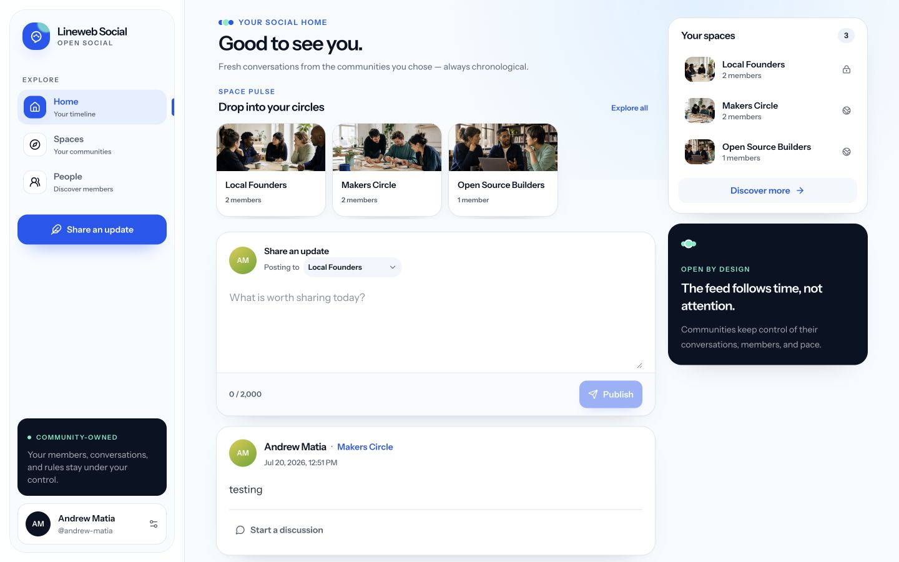
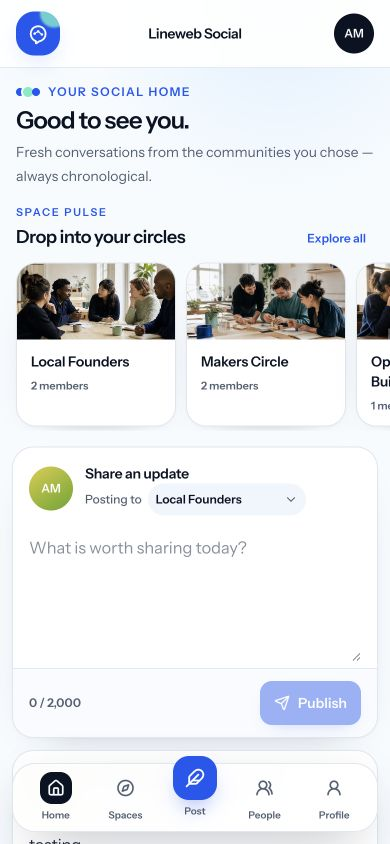
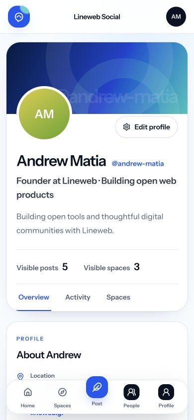

# Lineweb Social

[](https://github.com/drewmt/lineweb-social/actions/workflows/tests.yml)
[](LICENSE)
[](https://github.com/drewmt/lineweb-social/releases)

Lineweb Social is a Laravel-native, self-hosted foundation for calm, branded online communities and modern social products. It is built as a complete open core: useful community fundamentals first, followed by a stable extension ecosystem only after the core contract is proven.

The current release is `0.1.0-alpha.1`. It is suitable for local evaluation and community feedback, not production deployment.

## Product preview



<table>
  <tr>
    <td width="50%">
      
    </td>
    <td width="50%">
      
    </td>
  </tr>
  <tr>
    <td align="center"><sub>Chronological community feed</sub></td>
    <td align="center"><sub>Privacy-aware member profile</sub></td>
  </tr>
</table>

<sub>Current desktop and mobile screenshots use a local demo dataset; no private member data is included.</sub>

## Current vertical slice

- Verified accounts with passkey and two-factor support from Laravel Fortify.
- Public, private, and hidden spaces.
- Space creation, a searchable directory, public join/leave rules, and membership-based publishing.
- Expiring email invitations for restricted Spaces with hashed tokens and verified-account matching.
- Owner transfer, moderator role changes, reason-required member removal, and an auditable management log.
- A chronological, non-algorithmic feed.
- Membership-protected comments with a compact responsive conversation UI.
- Private post and comment reporting with allowlisted reasons, duplicate protection, and separate rate limits.
- A unified, policy-backed moderator queue with documented decisions, content hide/restore behavior, and append-only Space audit entries.
- Stable member handles, editable profiles with headlines, real visible
  activity summaries, and privacy-aware People discovery.
- Public, shared-Space-only, and private profile visibility with discovery opt-out.
- Private one-way muting, mutual blocking, feed filtering, and a dedicated Safety recovery screen.
- An editorial, app-first responsive interface with dedicated desktop and
  mobile navigation, a public product homepage, and complete member profiles.
- Server-side authorization, validation, and publishing rate limits.
- A local extension-manifest contract with explicit permission and UI-slot allowlists.
- React 19, Inertia 3, TypeScript, Tailwind CSS 4, and Laravel 13.

This is an early development build, not a production release. Messaging, media, notifications, full content search, data export/deletion, and a supported extension lifecycle are still pending.

## Local setup

Requirements: PHP 8.3+, Composer, Node.js, npm, and SQLite (or another Laravel-supported database).

```bash
git clone https://github.com/drewmt/lineweb-social.git
cd lineweb-social
composer run setup
composer run dev
```

The default development database is SQLite. Copy `.env.example` to `.env` if the setup script has not already done so.

Invitation emails use Laravel's configured mailer. The example environment logs mail locally; configure a real transactional provider before inviting people in a deployed environment.

## Quality checks

```bash
composer run test
npm run lint:check
npm run format:check
npm run types:check
npm run build
composer audit
npm audit --omit=dev
```

## Extension safety model

The current manifest prototype discovers extensions only from configured local directories during deployment. Manifests must use known permissions and UI slots. Runtime remote downloads, arbitrary ZIP installation, and automatic execution of unreviewed code are intentionally out of scope.

See [`extensions/example-polls/extension.json`](extensions/example-polls/extension.json) for the first contract example.

Moderation integrations can listen to after-transaction domain events. See [`docs/moderation.md`](docs/moderation.md) for the lifecycle, authorization boundaries, and guidance for adding new reportable content types.

The core owns identity, Spaces, visibility, safety relationships, conversations, and moderation. Product-specific experiences—photo grids, short-video feeds, professional timelines, events, commerce, or learning—should build on those boundaries through presentation layers and extensions rather than weakening core policies. See [`docs/platform-architecture.md`](docs/platform-architecture.md) for the current separation and the contracts that still need to mature.

## Contributing

Contributions are welcome when they strengthen the shared core without weakening privacy, moderation, or authorization boundaries. Start with [`CONTRIBUTING.md`](CONTRIBUTING.md) and open an issue before beginning a large change.

## License

Lineweb Social is free and open-source software licensed under
[`GPL-3.0-or-later`](LICENSE).

Copyright © 2026 Andrew Matia and [Lineweb](https://www.lineweb.gr).
