<div align="center">
  

  <h1>Lineweb Social</h1>

  <p><strong>Build the social product people want to stay in.</strong></p>

  <p>
    A Laravel-native, self-hosted foundation for modern communities,<br />
    creator networks, local platforms, and focused social products.
  </p>

  <p>
    <a href="https://github.com/drewmt/lineweb-social/actions/workflows/tests.yml"></a>
    <a href="https://github.com/drewmt/lineweb-social/releases"></a>
    <a href="LICENSE"></a>
    
    
  </p>

  <p>
    <a href="#product-tour">Product tour</a> ·
    <a href="#feature-map">Features</a> ·
    <a href="#quick-start">Quick start</a> ·
    <a href="#architecture-and-contracts">Architecture</a> ·
    <a href="CONTRIBUTING.md">Contributing</a>
  </p>
</div>

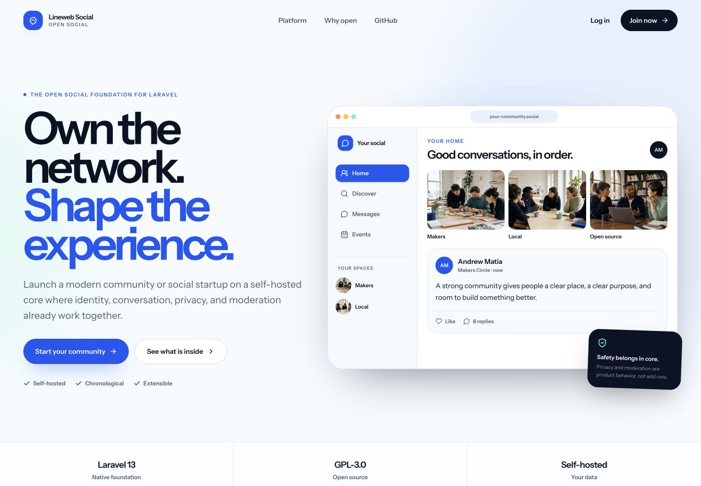

## A social foundation with a point of view

Lineweb Social is not a generic feed demo and it is not trying to hide important
platform decisions behind plugins. The core owns identity, visibility,
conversations, moderation, and member safety so teams can build distinctive
products without rebuilding the difficult boundaries first.

| Community-owned                                                                  | Calm by default                                                                                   | Built to extend                                                                                                  |
| -------------------------------------------------------------------------------- | ------------------------------------------------------------------------------------------------- | ---------------------------------------------------------------------------------------------------------------- |
| Self-hosted source, data, rules, and branding stay under the operator's control. | Chronological feeds, explicit relationships, and low-noise notifications avoid engagement tricks. | Stable domain events, a contract-first API, and an allowlisted extension model create room for focused products. |

### What you can build on it

- Branded customer or product communities.
- Creator, professional, alumni, or membership networks.
- Local and interest-based social platforms.
- Private organizational communities.
- A focused social startup with its own media, commerce, events, learning, or
  professional layer.

The goal is a strong shared core—not a clone with someone else's product
decisions baked in.

## Product tour

Every preview below uses synthetic local demo content. No private member data,
credentials, database, uploads, or generated build output are part of the public
repository.

### Community home

A responsive, chronological experience with clear publishing, conversation,
relationship, and navigation paths. Direct replies add human context without
recursive thread depth or changing the timeline's deterministic order.

<table>
  <tr>
    <td width="68%">
      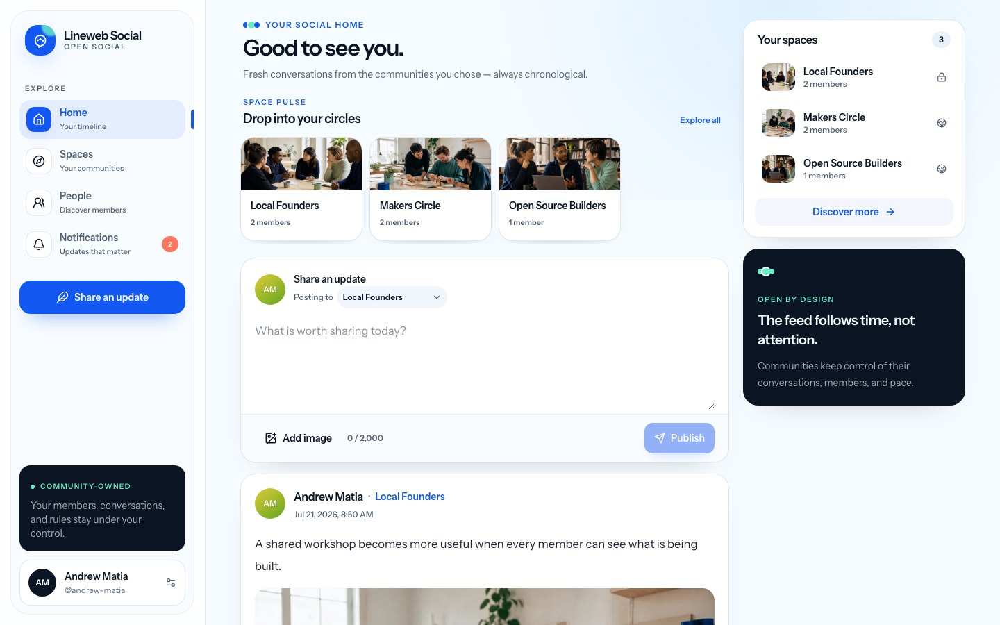
    </td>
    <td width="32%">
      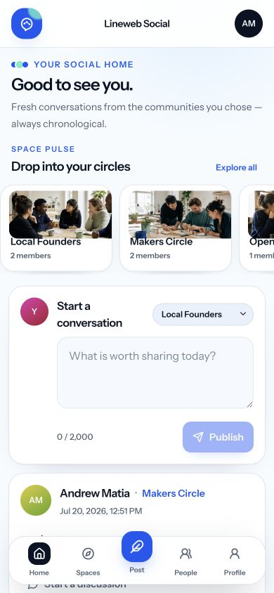
    </td>
  </tr>
  <tr>
    <td align="center"><sub>Focused desktop timeline</sub></td>
    <td align="center"><sub>App-first mobile feed</sub></td>
  </tr>
</table>

### Threaded conversations without the maze

Members can reply directly to a top-level comment while the conversation stays
chronological and easy to scan. A focused reply composer, clear parent identity,
recipient-aware notifications, and a strict one-level boundary provide useful
context without recursive thread depth.

<table>
  <tr>
    <td width="58%">
      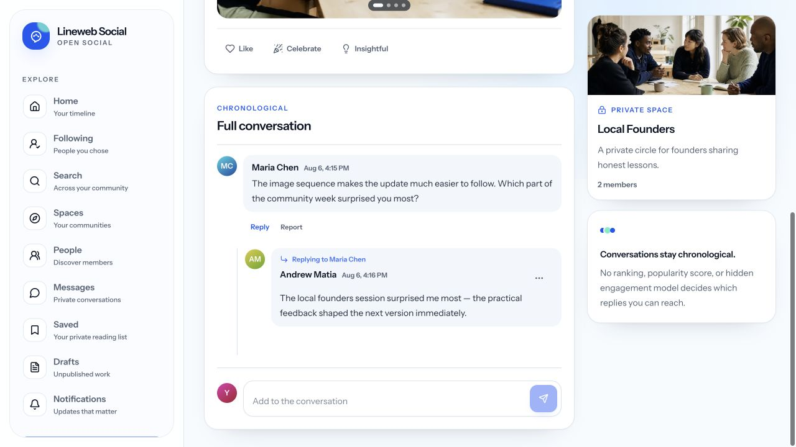
    </td>
    <td width="21%">
      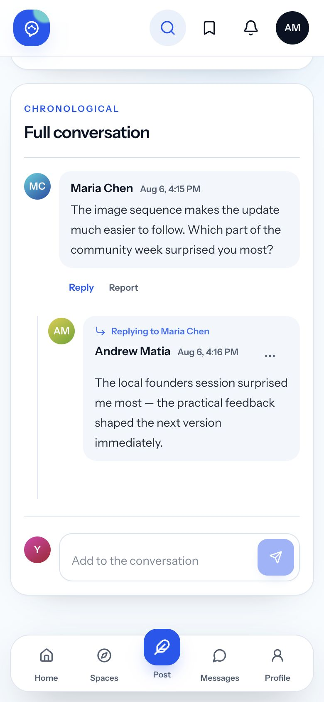
    </td>
    <td width="21%">
      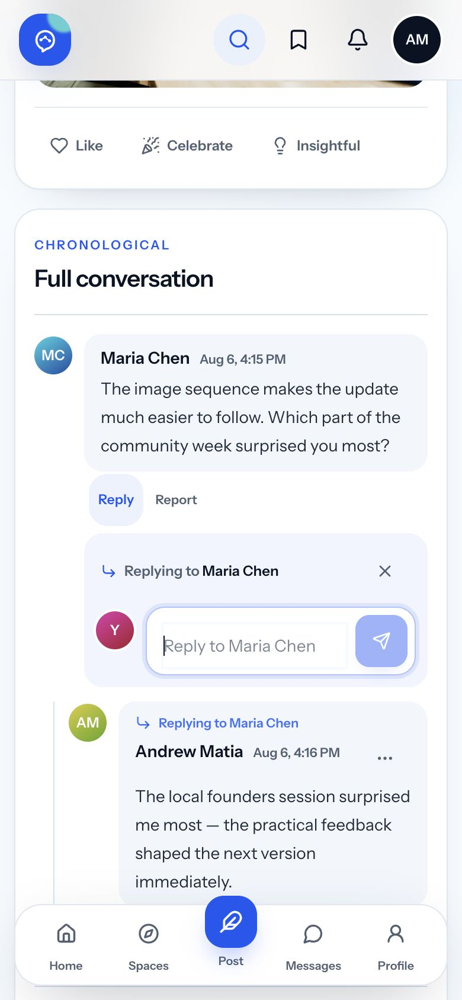
    </td>
  </tr>
  <tr>
    <td align="center"><sub>Chronological context on desktop</sub></td>
    <td align="center"><sub>Readable one-level replies on mobile</sub></td>
    <td align="center"><sub>Focused mobile reply composer</sub></td>
  </tr>
</table>

### Share with context, not leakage

Members can add a perspective to a post or send a clean repost without creating
a second, detached copy. Shares remain in the original Space, preserve its
visibility rules, and quietly drop source context if the original later becomes
unavailable. A quote still belongs to its author; an empty repost does not
survive without its source.

<table>
  <tr>
    <td width="68%">
      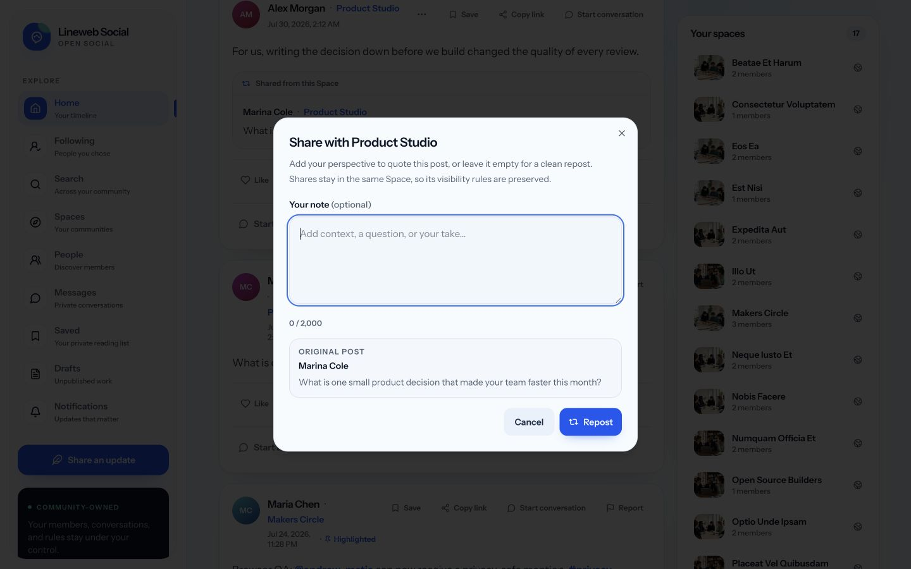
    </td>
    <td width="32%">
      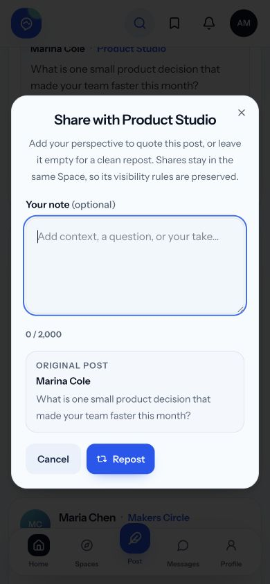
    </td>
  </tr>
  <tr>
    <td align="center"><sub>Optional context with the original post kept visible</sub></td>
    <td align="center"><sub>Focused, touch-friendly mobile share flow</sub></td>
  </tr>
</table>

### Publishing without pressure

A focused composer supports accessible four-image galleries and keeps unfinished
text and media private until the author chooses to publish. Members can return
through a dedicated draft library, curate retained images without reuploading
them, move a draft to another Space they can post in, and publish without
changing its post identity.

<table>
  <tr>
    <td width="58%">
      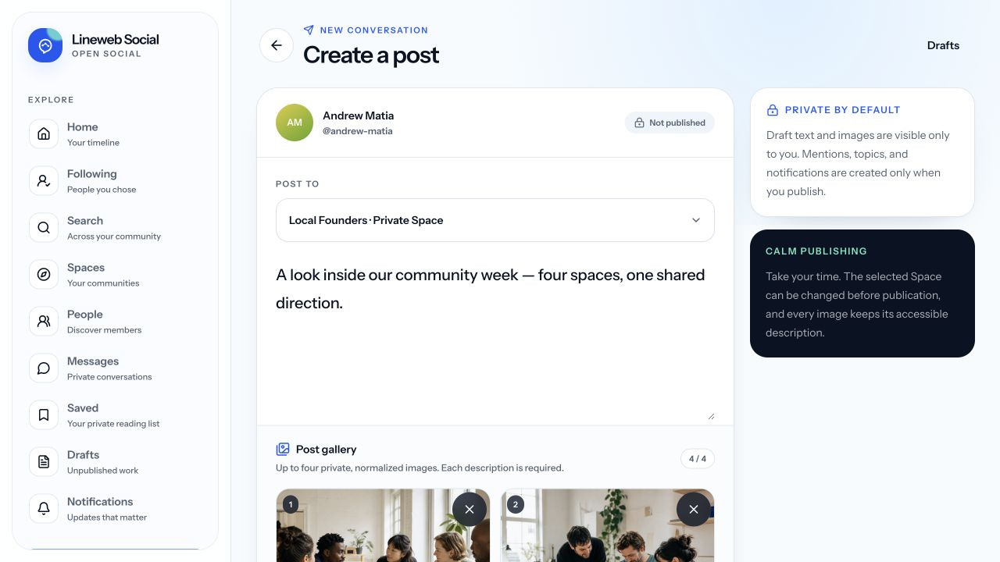
    </td>
    <td width="21%">
      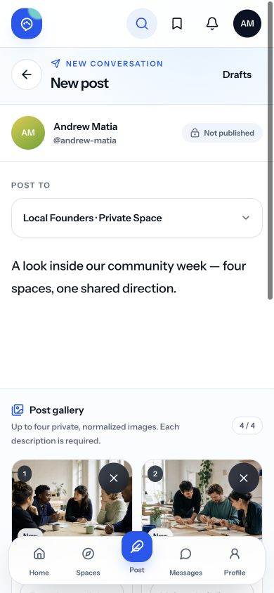
    </td>
    <td width="21%">
      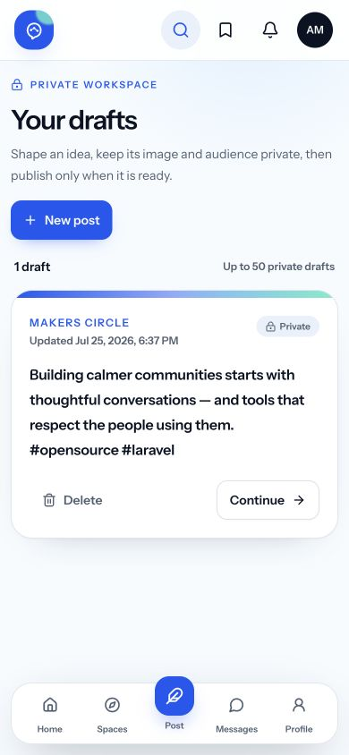
    </td>
  </tr>
  <tr>
    <td align="center"><sub>Focused writing and explicit publication</sub></td>
    <td align="center"><sub>App-first mobile composer</sub></td>
    <td align="center"><sub>Private unfinished work</sub></td>
  </tr>
</table>

### Accessible galleries in the timeline

Published galleries stay private behind the same post policy as their Space,
preserve an accessible description for every image, and use touch-friendly
swipe navigation with visible position and keyboard-sized controls.

<table>
  <tr>
    <td width="68%">
      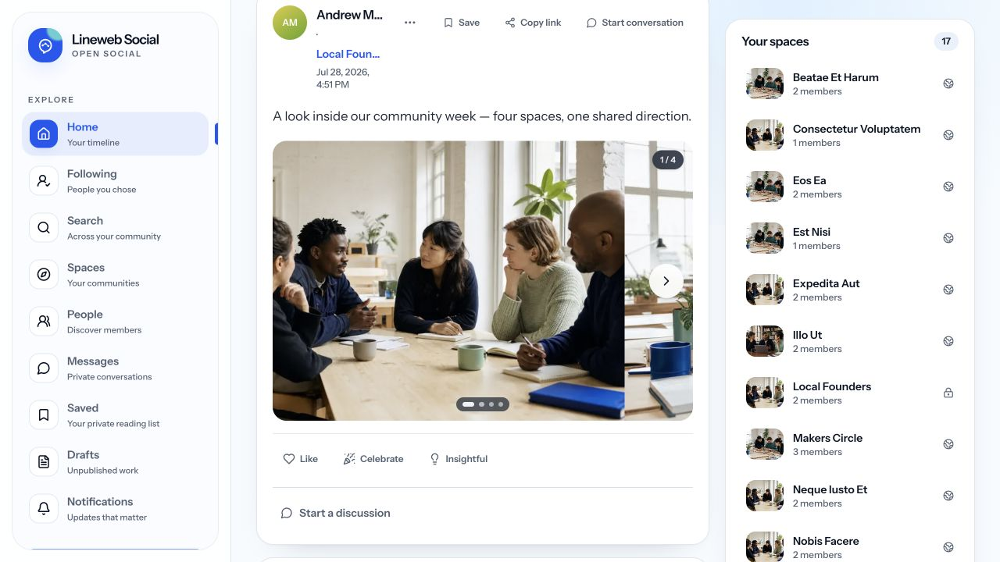
    </td>
    <td width="32%">
      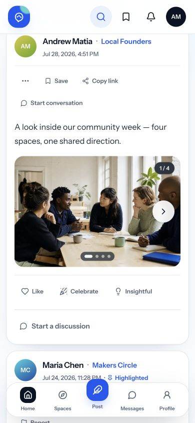
    </td>
  </tr>
  <tr>
    <td align="center"><sub>Policy-protected gallery on desktop</sub></td>
    <td align="center"><sub>Touch-first gallery on mobile</sub></td>
  </tr>
</table>

### Spaces and community operations

Public, private, and hidden Spaces combine publishing context with explicit
membership, invitation, role, ownership, moderation, and a bounded highlights
layer that never reorders the chronological timeline.

<table>
  <tr>
    <td width="38%">
      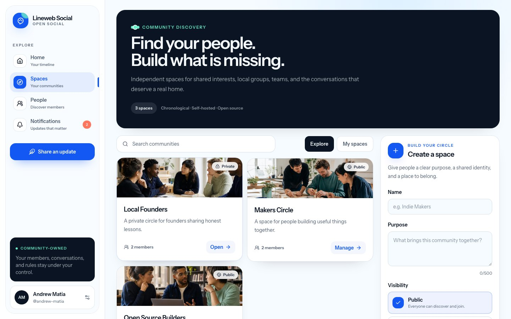
    </td>
    <td width="42%">
      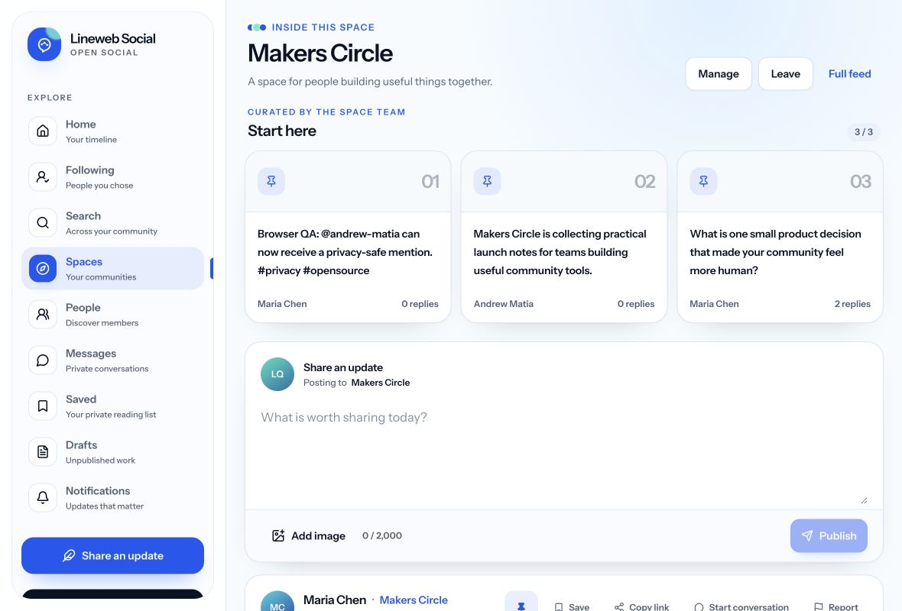
    </td>
    <td width="20%">
      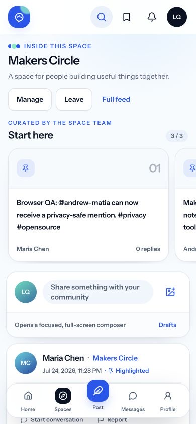
    </td>
  </tr>
  <tr>
    <td align="center"><sub>Searchable community directory</sub></td>
    <td align="center"><sub>Bounded curation without timeline ranking</sub></td>
    <td align="center"><sub>App-first swipe rail</sub></td>
  </tr>
</table>

### Discovery without weakening privacy

People, posts, Spaces, relationships, and topics remain discoverable only when
the current member is allowed to see them.

<table>
  <tr>
    <td width="68%">
      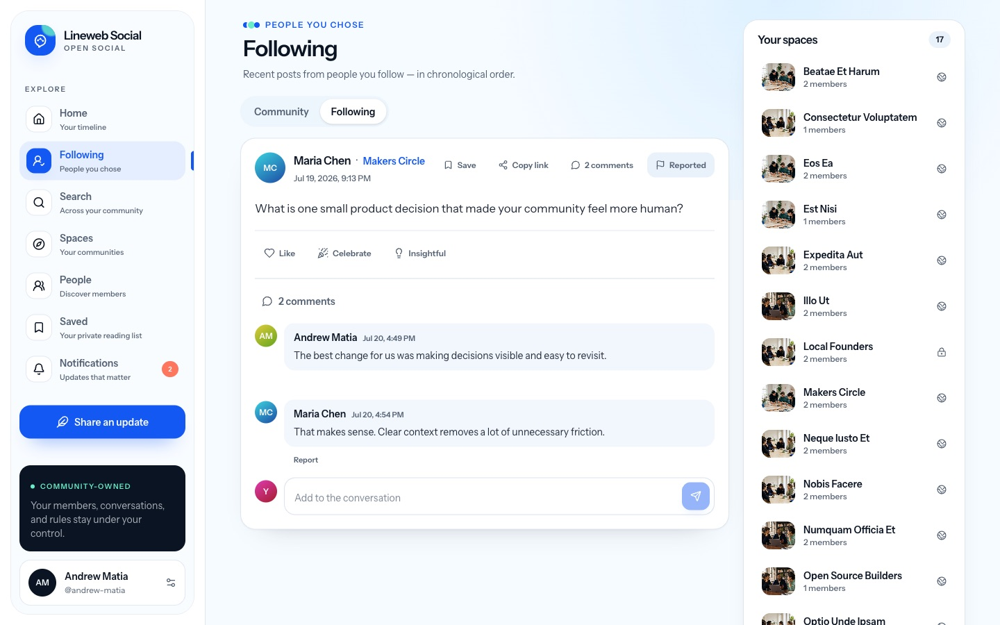
    </td>
    <td width="32%">
      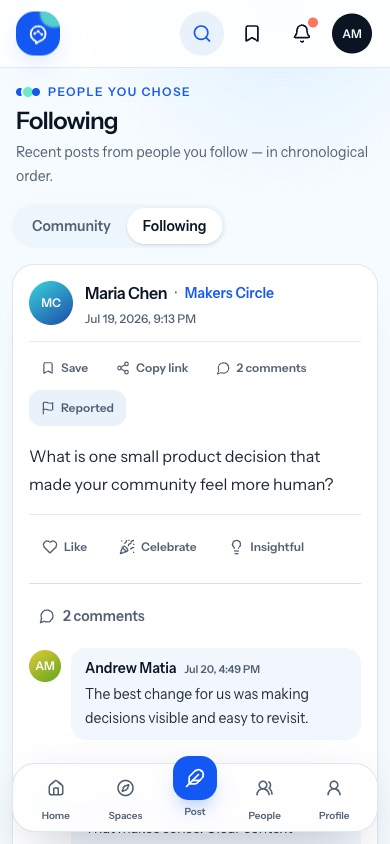
    </td>
  </tr>
  <tr>
    <td align="center"><sub>People you chose, in chronological order</sub></td>
    <td align="center"><sub>Private relationship state on mobile</sub></td>
  </tr>
</table>

### A guarded foundation for extensions

Operators can inspect every local extension manifest, its declared access,
compatibility, activation state, pending schema, checksum integrity, and
retained-data ownership plus immutable browser releases before deployment. A
broken package is reported independently, while provider activation,
backup-gated migrations, and asset publication stay in trusted deploy
operations rather than the browser.

<table>
  <tr>
    <td width="68%">
      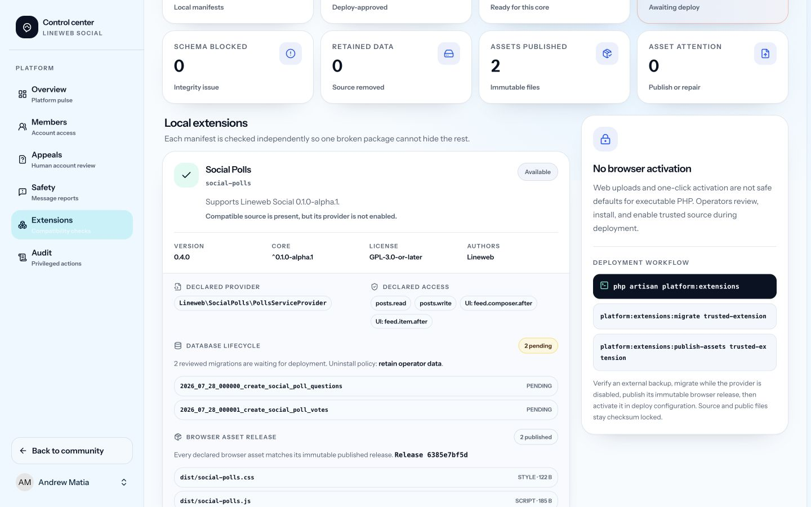
    </td>
    <td width="32%">
      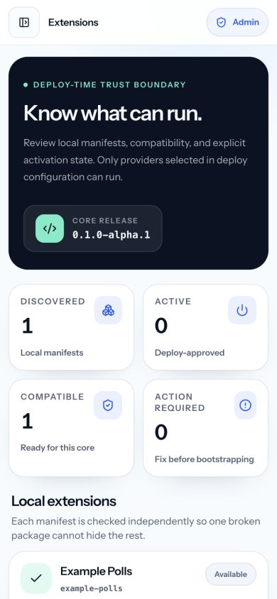
    </td>
  </tr>
  <tr>
    <td align="center"><sub>Schema, immutable browser releases, and retained ownership at a glance</sub></td>
    <td align="center"><sub>Content-addressed CSS and ES modules with SRI</sub></td>
  </tr>
</table>

<table>
  <tr>
    <td width="68%">
      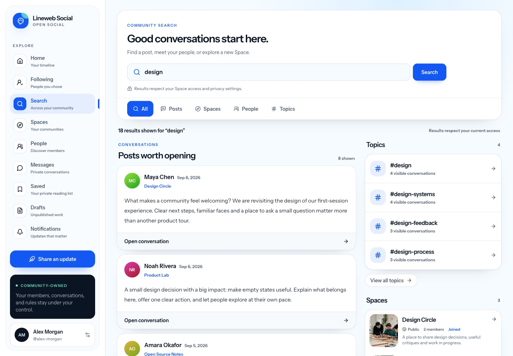
    </td>
    <td width="32%">
      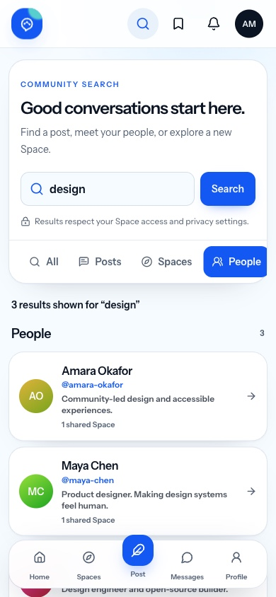
    </td>
  </tr>
  <tr>
    <td align="center"><sub>Grouped search across visible community content</sub></td>
    <td align="center"><sub>Focused mobile discovery</sub></td>
  </tr>
</table>

<table>
  <tr>
    <td width="68%">
      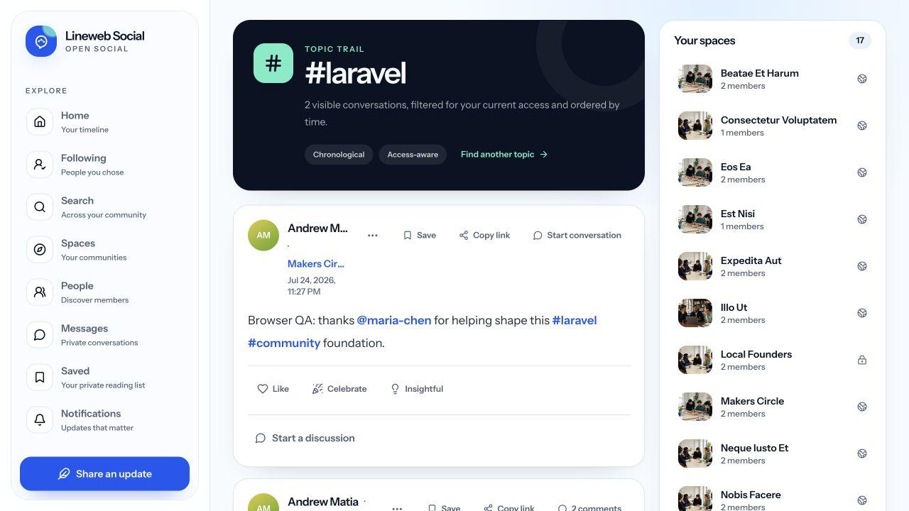
    </td>
    <td width="32%">
      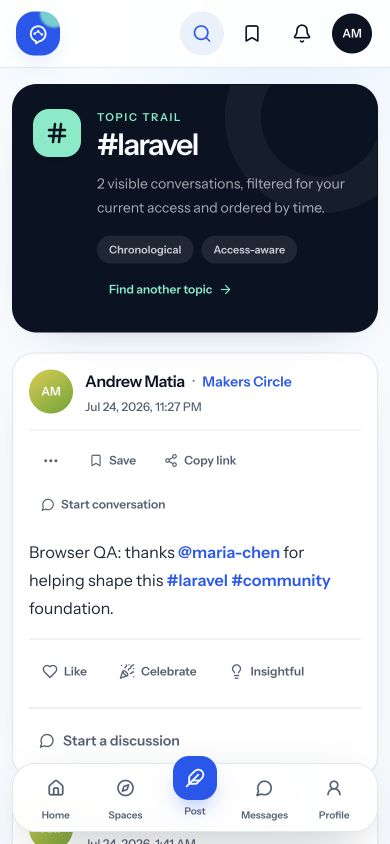
    </td>
  </tr>
  <tr>
    <td align="center"><sub>Chronological, access-aware topic trails</sub></td>
    <td align="center"><sub>Mobile hashtag discovery</sub></td>
  </tr>
</table>

### Useful notifications without inbox leakage

Members can keep delivery entirely in-app or opt into one daily email when
unread updates are waiting. The queued digest exposes only category counts,
rechecks access before delivery, and keeps private content and identities out of
email.

<table>
  <tr>
    <td width="68%">
      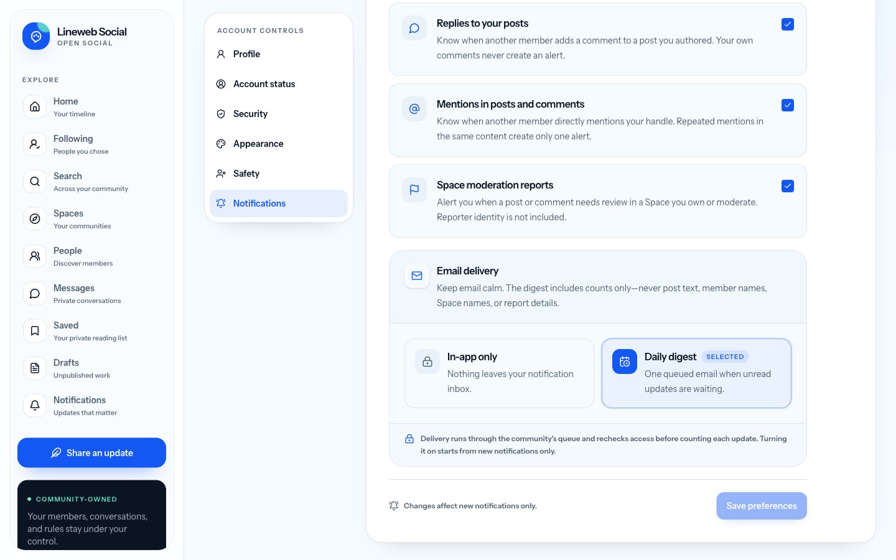
    </td>
    <td width="32%">
      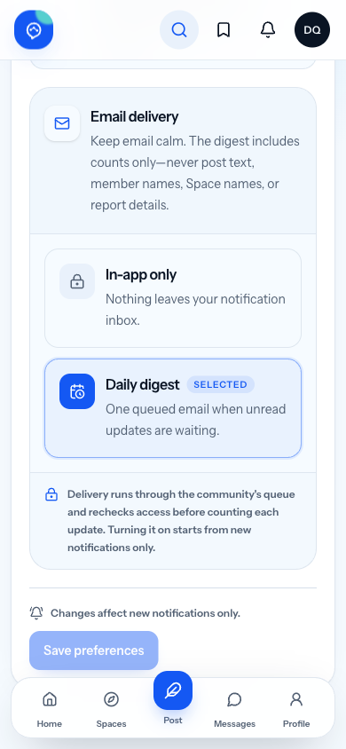
    </td>
  </tr>
  <tr>
    <td align="center"><sub>Separate in-app categories and opt-in email delivery</sub></td>
    <td align="center"><sub>Clear privacy boundary in an app-first layout</sub></td>
  </tr>
</table>

### Private conversations with a visible safety boundary

Direct Messages are participant-only, block-aware, and honest about server
access. A member can report the exact incoming message without exposing the
surrounding conversation to administrators.

<table>
  <tr>
    <td width="68%">
      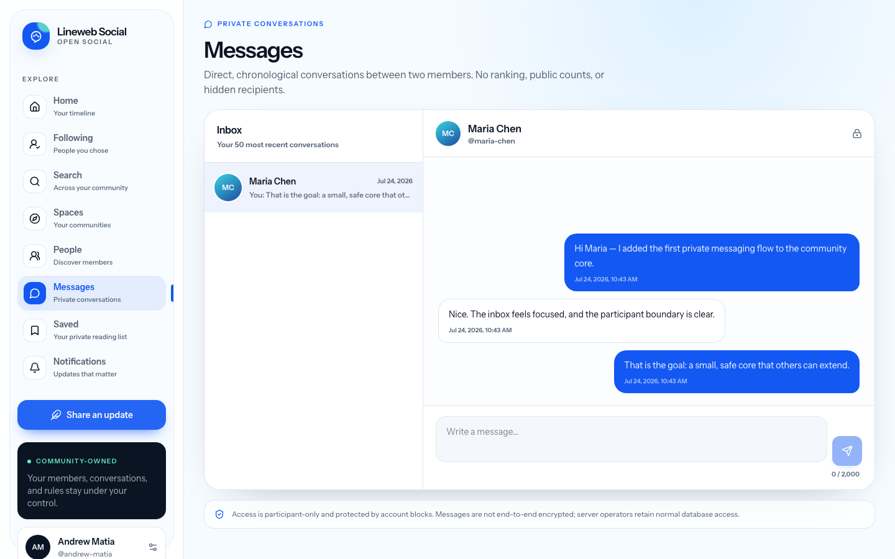
    </td>
    <td width="32%">
      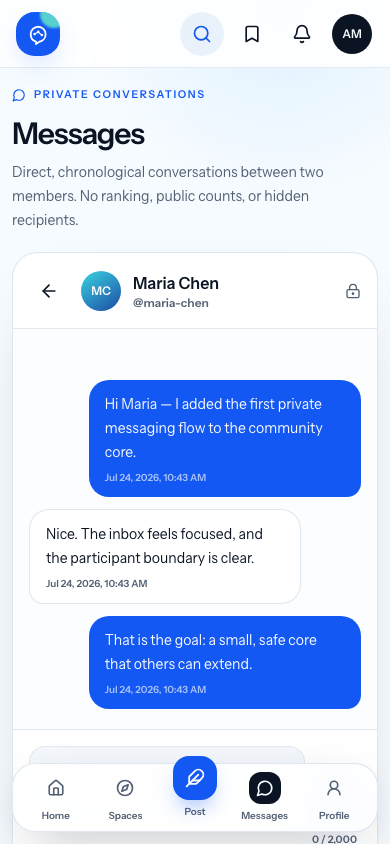
    </td>
  </tr>
  <tr>
    <td align="center"><sub>Focused two-person inbox and thread</sub></td>
    <td align="center"><sub>App-first mobile messaging</sub></td>
  </tr>
</table>

<table>
  <tr>
    <td width="68%">
      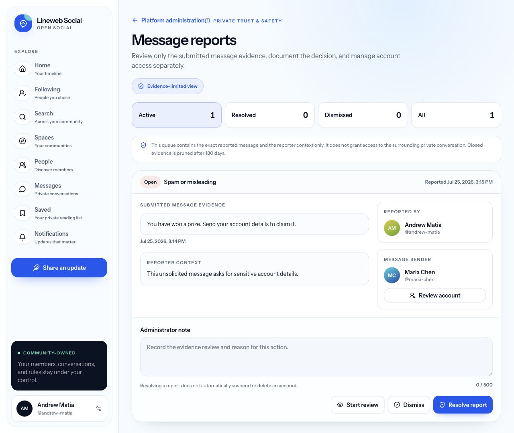
    </td>
    <td width="32%">
      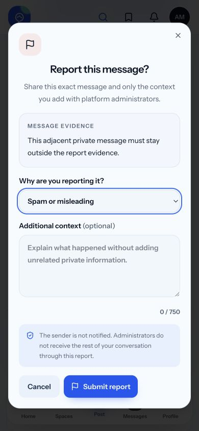
    </td>
  </tr>
  <tr>
    <td align="center"><sub>Exact-message evidence and documented operator decisions</sub></td>
    <td align="center"><sub>Clear reporting scope before submission</sub></td>
  </tr>
</table>

### Moderation and platform ownership

Space moderation and platform administration are separate permission
boundaries. Community teams manage their Spaces; trusted platform operators
work from a dedicated responsive control center with separate Overview,
Members, Appeals, Safety, and append-only Audit surfaces. Account restrictions
remain reason-required, account appeals are human-reviewed, and private safety
reviews expose only the evidence a member explicitly submitted.

<table>
  <tr>
    <td width="68%">
      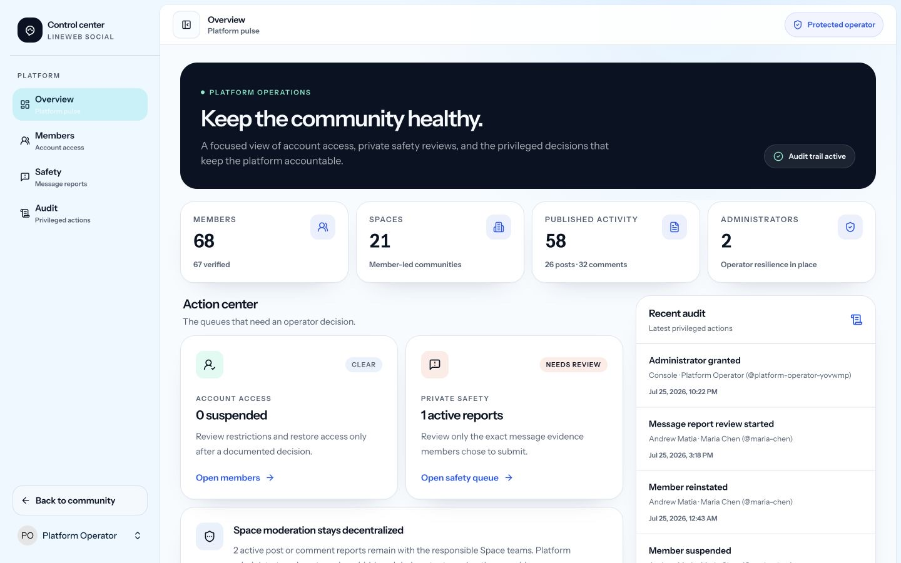
    </td>
    <td width="32%">
      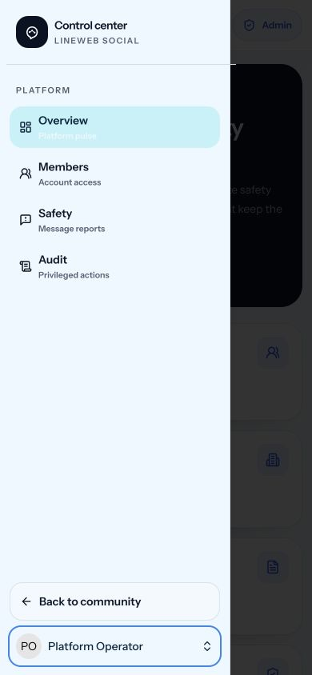
    </td>
  </tr>
  <tr>
    <td align="center"><sub>Focused operations, real queues, and privileged audit trail</sub></td>
    <td align="center"><sub>App-like mobile operator navigation</sub></td>
  </tr>
</table>

### Account decisions with a visible path back

Restricted members keep one clear Account Status surface, their data rights, and
one bounded appeal for each distinct restriction. Operators review it in a
dedicated queue; approval explicitly restores access and no automated system
makes the final decision.

<table>
  <tr>
    <td width="68%">
      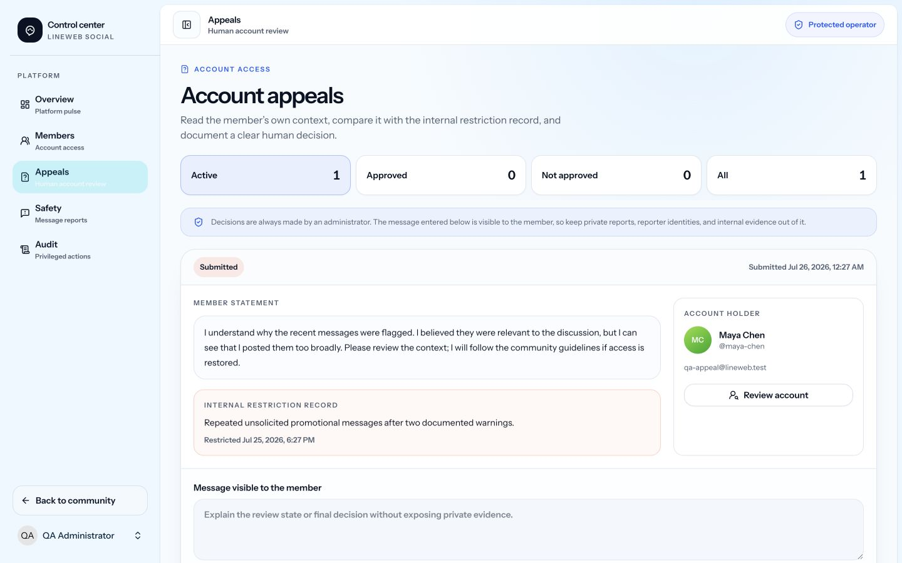
    </td>
    <td width="32%">
      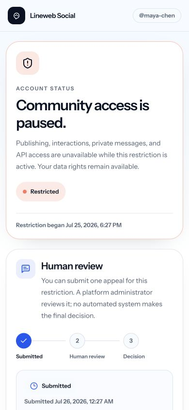
    </td>
  </tr>
  <tr>
    <td align="center"><sub>Member context, internal record, and explicit operator action</sub></td>
    <td align="center"><sub>Clear status, human review, and preserved data rights</sub></td>
  </tr>
</table>

<table>
  <tr>
    <td width="33%">
      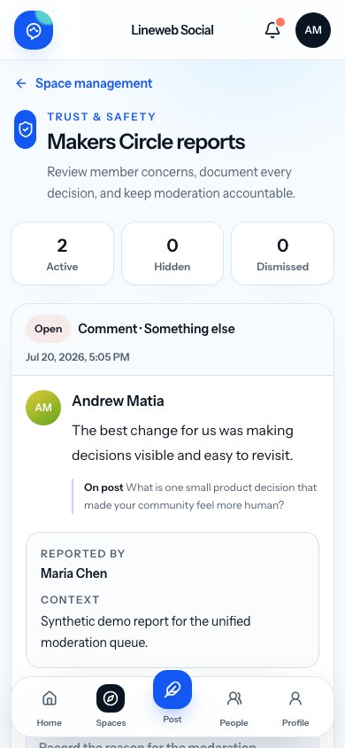
    </td>
    <td width="33%">
      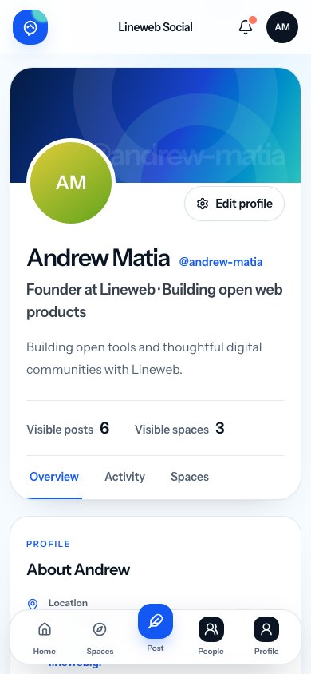
    </td>
    <td width="33%">
      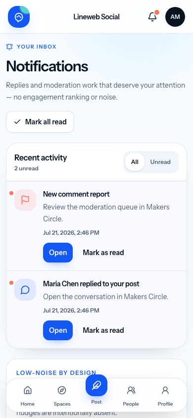
    </td>
  </tr>
  <tr>
    <td align="center"><sub>Accountable moderation</sub></td>
    <td align="center"><sub>Complete member profiles</sub></td>
    <td align="center"><sub>Low-noise notifications</sub></td>
  </tr>
</table>

## Feature map

| Area                | Included today                                                                                                                                                                                                                               |
| ------------------- | -------------------------------------------------------------------------------------------------------------------------------------------------------------------------------------------------------------------------------------------- |
| Accounts            | Verified registration, stable handles, passkeys, two-factor authentication, strong password defaults, active-account enforcement, and one human-reviewed appeal per restriction.                                                             |
| Profiles            | Editable member identity, headlines, real activity, public/shared/private visibility, and discovery opt-out.                                                                                                                                 |
| Spaces              | Public/private/hidden communities, searchable directory, join/leave rules, restricted invitations, roles, ownership transfer, member removal, and bounded curated highlights.                                                                |
| Publishing          | Focused composer, author-only drafts, private four-image WebP galleries with per-image alt text and swipe navigation, bounded private-first polls, chronological posts, privacy-safe quote posts and reposts, comments, permanent conversations, and author controls. |
| Discovery           | Policy-filtered search across posts, Spaces, and People; Unicode hashtags; chronological topic trails; and privacy-aware Following.                                                                                                          |
| Interactions        | Typed Like, Celebrate, and Insightful reactions, private Saved Posts, follows, mentions, one-level direct replies, same-Space quote/repost actions, comments, copy links, and conversation shortcuts.                              |
| Messaging           | Canonical one-to-one conversations, participant-only history, unread state, block-aware delivery, and responsive inbox/thread views.                                                                                                         |
| Trust and safety    | Mute, mutual block, Safety recovery, post/comment reporting, Space moderation queues, Direct Message reporting, and audited decisions.                                                                                                       |
| Notifications       | Database-backed replies, mentions, and moderation alerts with per-category preferences, destination access revalidation, and opt-in privacy-safe daily email digests.                                                                        |
| Platform operations | Dedicated responsive control center, console-granted administrators, focused member, appeals, and private-safety queues, transactional suspension/reinstatement, session and API-token revocation, and searchable append-only audit history. |
| Data rights         | Password-confirmed personal JSON export and self-service deletion with active-community ownership safeguards.                                                                                                                                |
| Developer surface   | Contract-first bearer API, scoped expiring Sanctum tokens, domain events, OpenAPI draft, allowlisted extension providers, checksum-owned migrations, and immutable SRI-backed CSS/ES-module releases.                                    |

## Product principles

### Chronological before algorithmic

The core does not rank a member's home or Following feed. Products can add a
different discovery layer later without making the shared social graph depend
on opaque engagement scoring.

### Safety belongs in the core

Visibility, mute, block, moderation, account access, report evidence, and audit
history are server-side contracts—not frontend decoration.

### Private means policy-enforced, not magically encrypted

Direct Messages and private media are access-controlled by the application.
Messages are not end-to-end encrypted, and server operators retain normal
database access.

### Extension points should not bypass the platform

The current extension foundation accepts configured local manifests with known
permissions and UI slots. Administrators can review each manifest,
compatibility, and active state; deployers explicitly allowlist reviewed
providers and enforce the same contract with `php artisan
platform:extensions`. Reviewed schema changes run only from explicit,
backup-gated CLI commands while providers are disabled; applied source is
checksum locked and removed source retains its data. Pre-built browser assets
use explicit content-addressed publication and SRI; their same-origin JavaScript
is reviewed trusted code, not a sandbox. Remote downloads, arbitrary ZIP
installation, browser actions, and destructive uninstall are intentionally
unavailable.

## Alpha status

> [!IMPORTANT]
> `0.1.0-alpha.1` is for local evaluation, extension-contract discussion, and
> early community feedback. It is not a production release.

The following are deliberately still outside the supported core:

- Message attachments, group conversations, realtime presence, and delivery
  receipts.
- Galleries, video, and direct-to-object-storage uploads.
- Web/mobile push delivery, instant email, and custom digest schedules.
- Advanced indexed search, a stable JavaScript UI-slot SDK, and destructive
  extension uninstall lifecycles.
- Complete audit archival/export and deployment-specific retention tooling.
- A production support, upgrade, and compatibility policy.

This boundary is intentional: the public source should be honest about what is
implemented, tested, and supported.

## Technology

| Layer                  | Stack                                                         |
| ---------------------- | ------------------------------------------------------------- |
| Backend                | PHP 8.3+, Laravel 13, Fortify, Sanctum                        |
| Frontend               | React 19, Inertia 3, TypeScript, Tailwind CSS 4               |
| Interface primitives   | Radix UI, Lucide icons                                        |
| Default local database | SQLite                                                        |
| Quality                | PHPUnit, PHPStan/Larastan, Pint, ESLint, Prettier, TypeScript |
| License                | GPL-3.0-or-later                                              |

## Quick start

Requirements:

- PHP 8.3+ with GD/WebP, EXIF, Fileinfo, and SQLite support.
- Composer 2.
- Node.js 22 and npm.

```bash
git clone https://github.com/drewmt/lineweb-social.git
cd lineweb-social
composer run setup
composer run dev
```

`composer run setup` installs dependencies, creates the local environment,
generates the application key, runs migrations, and builds the frontend. The
default example mailer writes messages to the local log; configure a real
transactional provider before inviting members in a deployment. Daily email
delivery is off by default; enabling it also requires Laravel's scheduler and a
worker that processes the `notifications` queue (for example,
`php artisan queue:work --queue=notifications,default`). Read the
[`notification delivery contract`](docs/notifications.md) before turning it on.

### Quality checks

```bash
composer run ci:check
npm run build
composer validate --strict
composer audit
npm audit --omit=dev
```

## Architecture and contracts

The implementation is intentionally documented around boundaries rather than
only code structure.

| Contract                                         | Documentation                                                                        |
| ------------------------------------------------ | ------------------------------------------------------------------------------------ |
| Platform boundaries and extension direction      | [`docs/platform-architecture.md`](docs/platform-architecture.md)                     |
| Extension manifests and compatibility inspection | [`docs/extensions.md`](docs/extensions.md)                                           |
| Extension migration ownership and rollback       | [`docs/extension-migrations.md`](docs/extension-migrations.md)                       |
| Extension browser assets and integrity            | [`docs/extension-assets.md`](docs/extension-assets.md)                               |
| Authenticated API and machine-readable draft     | [`docs/api-v1.md`](docs/api-v1.md) · [`docs/openapi.json`](docs/openapi.json)        |
| Direct Messages                                  | [`docs/direct-messages.md`](docs/direct-messages.md)                                 |
| Chronological comments and direct replies        | [`docs/conversations.md`](docs/conversations.md)                                     |
| Private message reporting and evidence retention | [`docs/message-reporting.md`](docs/message-reporting.md)                             |
| Post/comment moderation and domain events        | [`docs/moderation.md`](docs/moderation.md)                                           |
| Notification privacy and delivery categories     | [`docs/notifications.md`](docs/notifications.md)                                     |
| Private post drafts and publication boundary     | [`docs/post-drafts.md`](docs/post-drafts.md)                                         |
| Post polls and aggregate-result boundary         | [`docs/post-polls.md`](docs/post-polls.md)                                           |
| Post media validation and lifecycle              | [`docs/media.md`](docs/media.md)                                                     |
| Unicode topics and visibility                    | [`docs/topics.md`](docs/topics.md)                                                   |
| Platform administration                          | [`docs/platform-administration.md`](docs/platform-administration.md)                 |
| Account status and human-reviewed appeals        | [`docs/account-appeals.md`](docs/account-appeals.md)                                 |
| Personal export and account deletion             | [`docs/privacy-and-data-rights.md`](docs/privacy-and-data-rights.md)                 |
| Example extension manifest                       | [`extensions/example-polls/extension.json`](extensions/example-polls/extension.json) |

## Contributing

Contributions are welcome when they strengthen the shared core without
weakening privacy, moderation, or authorization boundaries.

1. Read [`CONTRIBUTING.md`](CONTRIBUTING.md).
2. Check existing issues and pull requests before starting.
3. Open an issue before a large architectural change.
4. Keep changes focused, tested, documented, and compatible with the public
   contracts.

Please also follow the [`Code of Conduct`](CODE_OF_CONDUCT.md) and report
security concerns through [`SECURITY.md`](SECURITY.md), not a public issue.

## License and credits

Lineweb Social is free and open-source software licensed under
[`GPL-3.0-or-later`](LICENSE).

Created by [Andrew Matia](https://andrewmatia.eu) and
[Lineweb](https://www.lineweb.gr).

Copyright © 2026 Andrew Matia and Lineweb.
