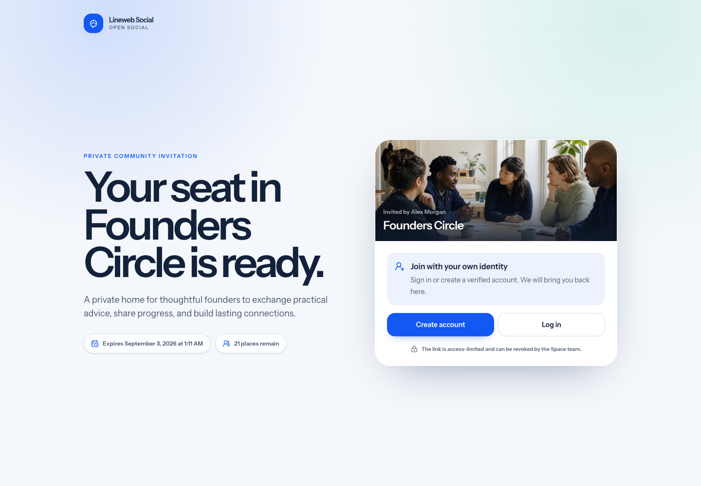

# Shareable Space invite links

Shareable invite links let a Space team onboard a small group without issuing
one invitation per email address. They are intentionally bounded credentials,
not public membership URLs and not a way to assign privileged roles.

## Authorization and membership

- Only the Space owner or a current moderator can create or revoke a link.
- Every accepted link grants the regular `member` role.
- Shareable links cannot create owners or moderators.
- Acceptance still requires an active, authenticated, email-verified account.
- A member who already belongs to the Space can safely revisit the link without
  consuming another use.
- A link cannot be revoked through another Space route, even when identifiers
  are known.

These rules are checked at the HTTP policy boundary and again inside the
transactional domain service.

## Token and limit contract

The creator chooses an optional internal label, an expiry from 1 to 30 days,
and a maximum of 1 to 100 successful memberships. A Space can have at most 20
active links at once.

The application generates a 64-character random token. The full URL is flashed
to the creator once and is not available from the management page again. Only
the SHA-256 token digest is stored. Database rows also keep the creator,
expiry, maximum uses, successful-use count, revocation time, and timestamps.

Acceptance locks both the invitation row and its Space before checking
availability and creating membership. This keeps the usage bound authoritative
when several people accept near the same time. Revocation uses the same locked
write boundary.

## Guest and account journey

The public preview exposes only the Space name, description, generated cover,
creator display name, expiry, and remaining-use count. It does not expose the
member directory, posts, hidden metadata, audit history, internal label, or
stored token digest.

An available token is preserved in the guest session. Login returns directly
to the preview through Laravel's intended destination. Registration and email
verification return through the authenticated dashboard, which consumes the
pending token and restores the same preview. Unavailable tokens are removed
from pending session state.

## Audit and privacy

Creation, successful acceptance, and revocation append records to the Space
audit log. Audit context contains the invite-link identifier and bounded
operational metadata, never the plaintext token.

A creator's personal export includes the Space slug, internal label, maximum
uses, successful-use count, expiry, revocation, and timestamps. Token digests
are deliberately excluded. An accepting member's export continues to represent
the resulting Space membership without disclosing the creator's private link
metadata.

Operators should treat a copied invitation URL as a credential. Use short
expiry and low usage limits for sensitive communities, revoke links that reach
an unintended audience, and avoid placing invitation URLs in analytics or
support logs.

## Extension boundary

Extensions may observe the resulting membership and audit records, but should
not bypass the core acceptance service, mint unbounded links, expose token
digests, or introduce privileged-role links. Alternative onboarding surfaces
must preserve verification, active-account, membership, usage, and audit
invariants.
